# Arquitetura do Sistema

# Documentação de Arquitetura - babi.ai v3

## 1. Visão Geral da Arquitetura

A babi.ai é uma plataforma de mentoria em vendas via IA, desenvolvida com arquitetura modular e orientada a microsserviços, integrando WhatsApp como interface principal de interação e um dashboard web para configurações administrativas.

### 1.1 Princípios Arquiteturais

- **Arquitetura Event-Driven**: Comunicação assíncrona entre componentes
- **Microserviços Especializados**: Cada componente tem responsabilidade específica
- **API-First Design**: Todas as integrações via APIs REST/GraphQL
- **Escalabilidade Horizontal**: Preparado para crescimento de usuários
- **Resiliência**: Tratamento de falhas e retry policies

## 2. Diagrama de Arquitetura de Alto Nível

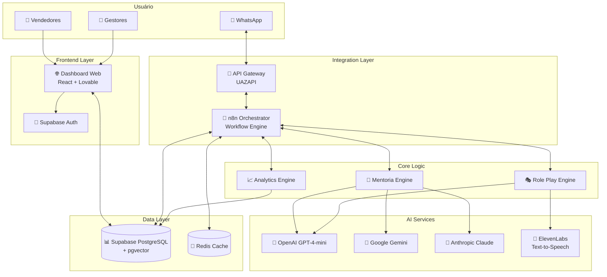

## 3. Arquitetura Detalhada por Camada

### 3.1 Frontend Layer

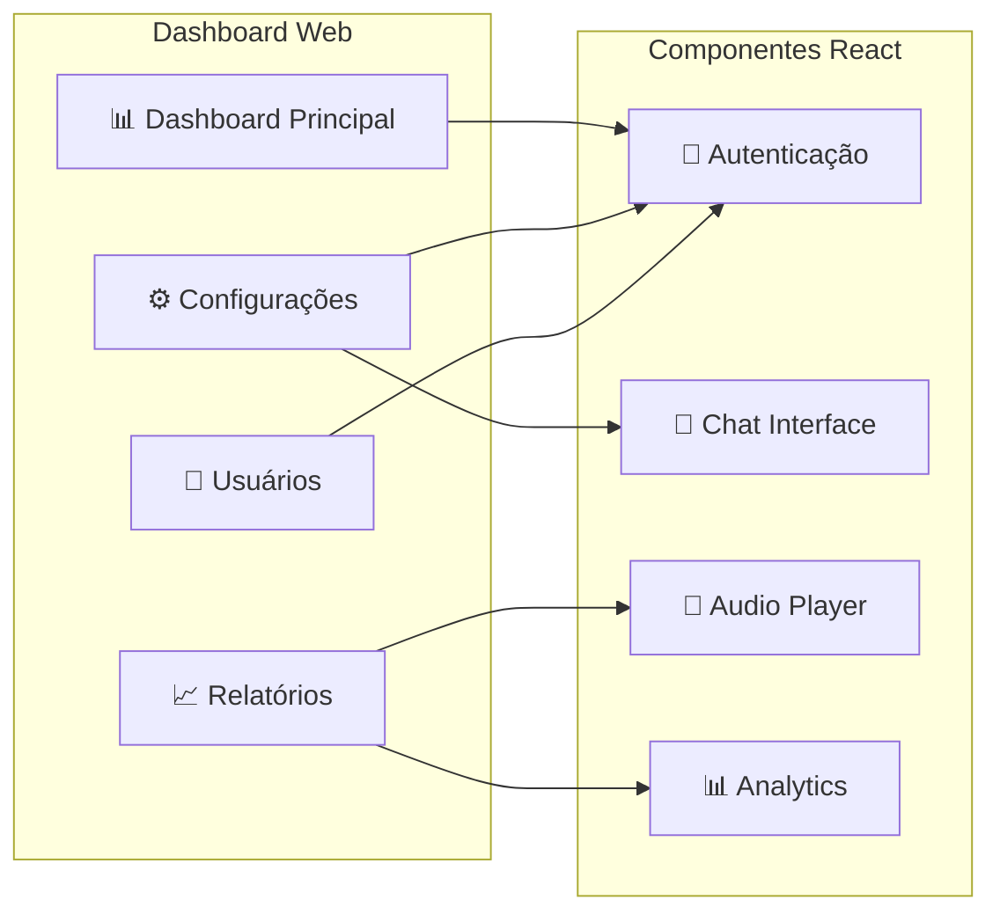

**Responsabilidades:**
- Interface administrativa para configuração de usuários
- Dashboard de métricas e analytics
- Configuração de metodologias de vendas
- Gestão de sessões de role play
- Visualização de histórico de conversas

### 3.2 Integration Layer

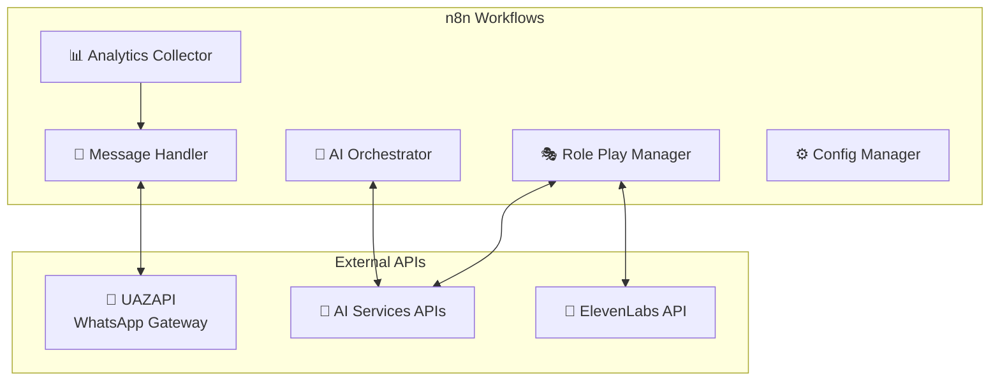

**Responsabilidades:**
- Orquestração de workflows de mentoria
- Roteamento inteligente de mensagens
- Gestão de estado das conversas
- Integração com serviços de IA
- Processamento de comandos especializados

### 3.3 Data Layer

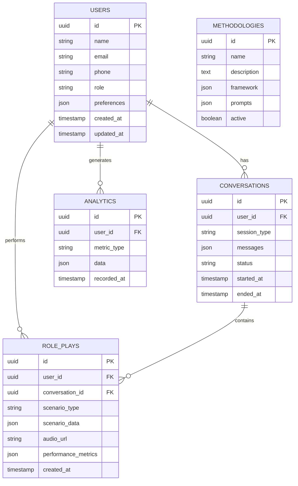

## 4. Fluxo de Dados Principal

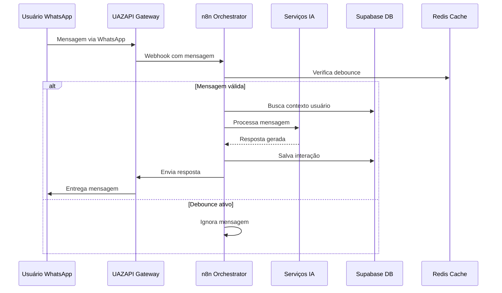

## 5. Componentes e Responsabilidades

### 5.1 Agente Orquestrador (n8n)

**Workflows Principais:**

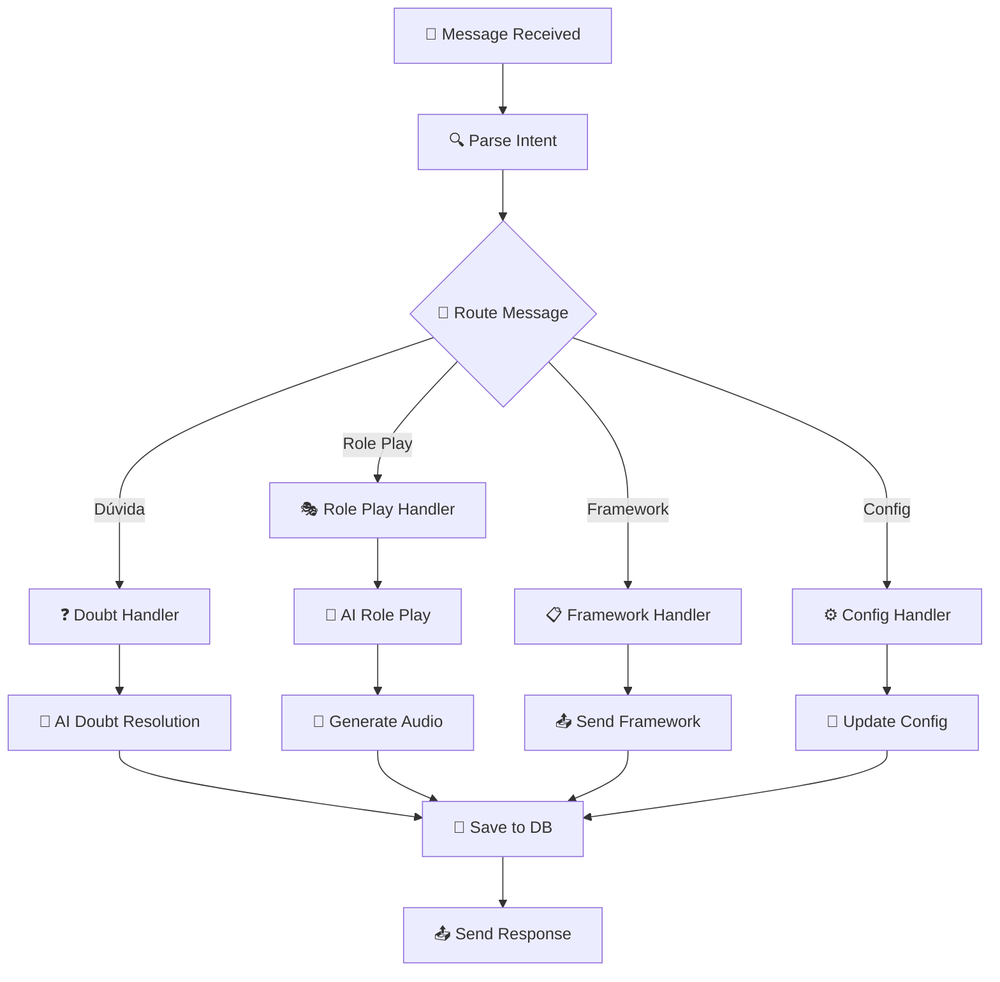

**Funcionalidades:**
- Processamento de mensagens recebidas
- Classificação de intenções do usuário
- Delegação para subagentes especializados
- Controle de contexto conversacional
- Gerenciamento de estados de sessão

### 5.2 Mentoria Engine

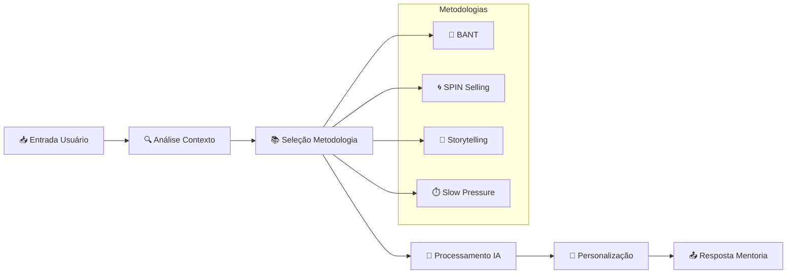

### 5.3 Role Play Engine

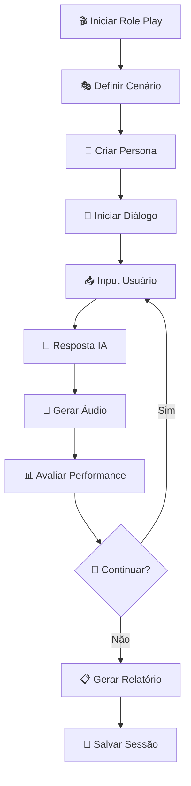

### 5.4 Sistema de Analytics

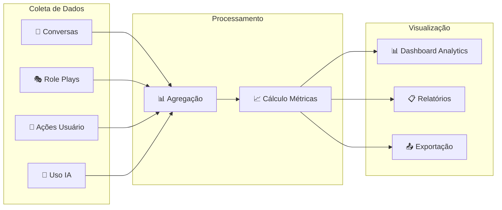

## 6. Especificação de APIs

### 6.1 API de Usuários

**Endpoints principais:**

```
GET /api/users/{userId}
POST /api/users
PUT /api/users/{userId}
DELETE /api/users/{userId}

POST /api/users/{userId}/preferences
GET /api/users/{userId}/analytics
```

### 6.2 API de Conversas

```
GET /api/conversations?userId={userId}
POST /api/conversations
PUT /api/conversations/{conversationId}
GET /api/conversations/{conversationId}/messages
```

### 6.3 API de Role Plays

```
POST /api/roleplays/start
PUT /api/roleplays/{rolePlayId}/message
GET /api/roleplays/{rolePlayId}/audio
POST /api/roleplays/{rolePlayId}/complete
```

## 7. Fluxos de Trabalho Principais

### 7.1 Fluxo de Mentoria Básica

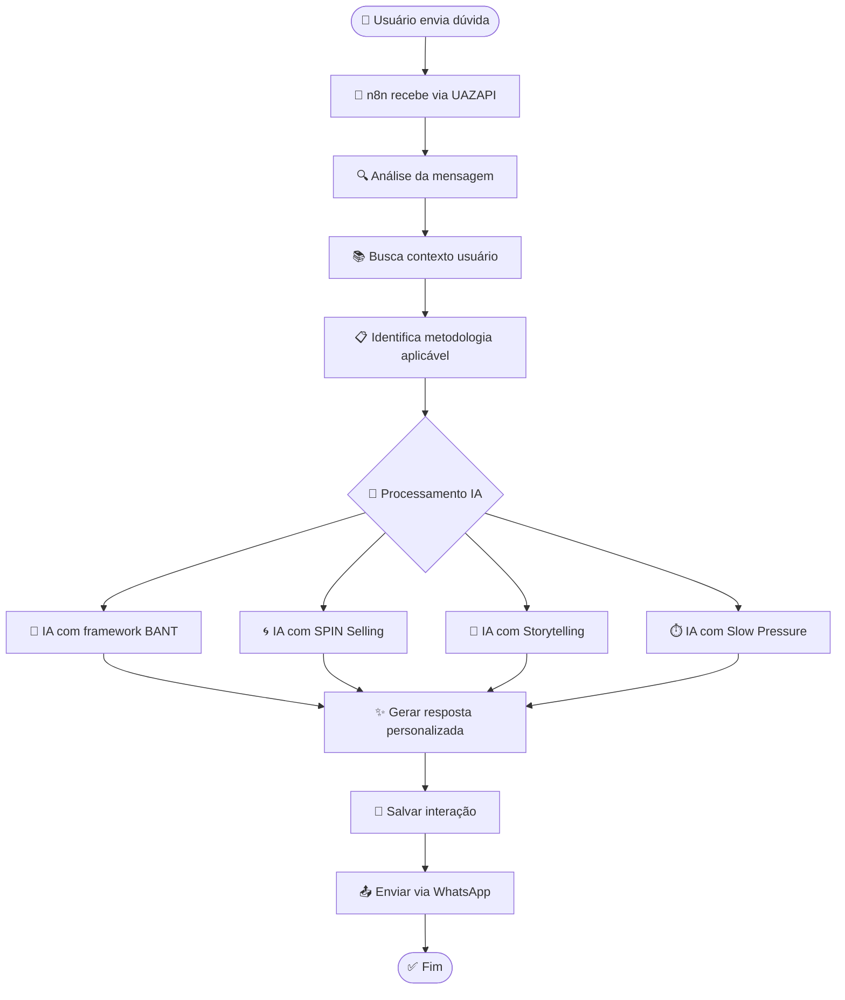

### 7.2 Fluxo de Role Play com Áudio

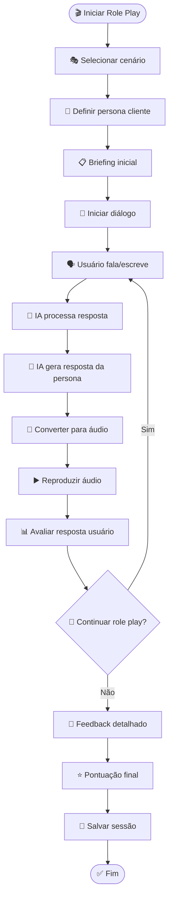

## 8. Estrutura de Banco de Dados

### 8.1 Schema Principal

```mermaid
erDiagram
    users {
        uuid id PK
        string name
        string email
        string phone_number
        string role
        json sales_profile
        json ai_preferences
        timestamp created_at
        timestamp updated_at
        boolean is_active
    }

    conversations {
        uuid id PK
        uuid user_id FK
        string conversation_type
        json messages_history
        string current_methodology
        string status
        json context_data
        timestamp started_at
        timestamp last_activity
    }

    methodologies {
        uuid id PK
        string name
        text description
        json framework_structure
        json ai_prompts
        json parameters
        boolean is_active
        timestamp created_at
    }

    role_play_sessions {
        uuid id PK
        uuid user_id FK
        uuid conversation_id FK
        string scenario_type
        json persona_data
        json dialogue_history
        string audio_file_url
        json performance_metrics
        integer score
        text feedback
        timestamp started_at

---
*Tipo: architecture*
*Gerado pelo ForgeAI em 07/02/2026*
