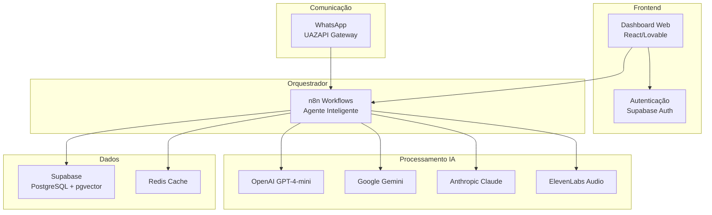

# Documentação Técnica

# Documentação Técnica - babi.ai v3
## Mentora de Vendas IA via WhatsApp

---

## 📋 Sumário Executivo

### Visão Geral
O **babi.ai v3** é uma plataforma Micro-SaaS que funciona como mentora de vendas baseada em inteligência artificial, acessível via WhatsApp. A solução oferece capacitação e suporte contínuo para profissionais de vendas através das metodologias comprovadas da Barbara D'Elia, incluindo BANT, SPIN Selling, Storytelling e Slow Pressure Selling.

### Objetivos do Projeto
- Desenvolver uma mentora de IA especializada em vendas acessível via WhatsApp
- Implementar metodologias estruturadas de vendas da Barbara D'Elia
- Oferecer role plays interativos com geração de áudio
- Proporcionar dashboard web para configurações e analytics
- Criar arquitetura modular e escalável

### Público-Alvo
- **Vendedores**: SDR, Closer, Account Executive
- **Gestores de Vendas**: Empresários e líderes de equipe comercial

---

## 🏗️ Arquitetura do Sistema

### Visão Geral da Arquitetura


### Componentes Principais

| Componente | Tecnologia | Responsabilidade |
|------------|------------|------------------|
| **Frontend** | React/Lovable | Interface web, configurações, analytics |
| **Autenticação** | Supabase Auth | Gestão de usuários e sessões |
| **Orquestrador** | n8n | Lógica conversacional e delegação |
| **Gateway WhatsApp** | UAZAPI | Comunicação via WhatsApp |
| **LLMs** | GPT-4-mini, Gemini, Claude | Processamento de linguagem natural |
| **Áudio** | ElevenLabs | Geração de áudio para role plays |
| **Banco de Dados** | Supabase (PostgreSQL + pgvector) | Persistência e vetorização |
| **Cache** | Redis | Otimização e debounce de mensagens |

---

## 💻 Stack Tecnológica

### Frontend
- **Framework**: React via Lovable
- **Autenticação**: Supabase Auth
- **Estilização**: TailwindCSS (baseado na identidade visual)
- **Estado**: Context API / Zustand
- **Roteamento**: React Router

### Backend & Orquestração
- **Orquestrador**: n8n (Self-hosted)
- **Banco de Dados**: Supabase PostgreSQL + pgvector
- **Cache**: Redis
- **API Gateway**: UAZAPI (WhatsApp)

### Inteligência Artificial
- **LLMs**: 
  - OpenAI GPT-4-mini (principal)
  - Google Gemini (secundário)
  - Anthropic Claude (alternativo)
- **Geração de Áudio**: ElevenLabs
- **Embeddings**: pgvector (Supabase)

### Ferramentas de Desenvolvimento
- **IDE**: Windsurf
- **Assistente IA**: Claude
- **Deploy Frontend**: Lovable

---

## 📊 Modelagem de Dados

### Estrutura do Banco (Supabase)

```sql
-- Tabela de usuários (extende auth.users)
CREATE TABLE profiles (
    id UUID REFERENCES auth.users(id) PRIMARY KEY,
    email TEXT UNIQUE NOT NULL,
    full_name TEXT,
    company TEXT,
    role TEXT CHECK (role IN ('sdr', 'closer', 'account_executive', 'manager')),
    phone TEXT,
    whatsapp_number TEXT UNIQUE,
    onboarding_completed BOOLEAN DEFAULT FALSE,
    created_at TIMESTAMP WITH TIME ZONE DEFAULT NOW(),
    updated_at TIMESTAMP WITH TIME ZONE DEFAULT NOW()
);

-- Tabela de conversas
CREATE TABLE conversations (
    id UUID DEFAULT gen_random_uuid() PRIMARY KEY,
    user_id UUID REFERENCES profiles(id),
    whatsapp_number TEXT NOT NULL,
    status TEXT DEFAULT 'active' CHECK (status IN ('active', 'paused', 'ended')),
    context JSONB DEFAULT '{}',
    created_at TIMESTAMP WITH TIME ZONE DEFAULT NOW(),
    updated_at TIMESTAMP WITH TIME ZONE DEFAULT NOW()
);

-- Tabela de mensagens
CREATE TABLE messages (
    id UUID DEFAULT gen_random_uuid() PRIMARY KEY,
    conversation_id UUID REFERENCES conversations(id),
    direction TEXT CHECK (direction IN ('inbound', 'outbound')),
    content TEXT NOT NULL,
    message_type TEXT DEFAULT 'text' CHECK (message_type IN ('text', 'audio', 'document')),
    metadata JSONB DEFAULT '{}',
    processed_by TEXT, -- qual LLM processou
    created_at TIMESTAMP WITH TIME ZONE DEFAULT NOW()
);

-- Tabela de sessões de role play
CREATE TABLE roleplay_sessions (
    id UUID DEFAULT gen_random_uuid() PRIMARY KEY,
    user_id UUID REFERENCES profiles(id),
    scenario TEXT NOT NULL,
    methodology TEXT CHECK (methodology IN ('bant', 'spin', 'storytelling', 'slow_pressure')),
    status TEXT DEFAULT 'active' CHECK (status IN ('active', 'paused', 'completed')),
    audio_files TEXT[], -- URLs dos áudios gerados
    feedback JSONB DEFAULT '{}',
    score INTEGER CHECK (score >= 0 AND score <= 100),
    created_at TIMESTAMP WITH TIME ZONE DEFAULT NOW(),
    completed_at TIMESTAMP WITH TIME ZONE
);

-- Tabela de base de conhecimento
CREATE TABLE knowledge_base (
    id UUID DEFAULT gen_random_uuid() PRIMARY KEY,
    user_id UUID REFERENCES profiles(id), -- NULL para conhecimento global
    title TEXT NOT NULL,
    content TEXT NOT NULL,
    category TEXT,
    tags TEXT[],
    embedding vector(1536), -- OpenAI embeddings
    is_public BOOLEAN DEFAULT FALSE,
    created_at TIMESTAMP WITH TIME ZONE DEFAULT NOW()
);

-- Tabela de analytics
CREATE TABLE user_analytics (
    id UUID DEFAULT gen_random_uuid() PRIMARY KEY,
    user_id UUID REFERENCES profiles(id),
    metric_name TEXT NOT NULL,
    metric_value NUMERIC NOT NULL,
    metadata JSONB DEFAULT '{}',
    recorded_at TIMESTAMP WITH TIME ZONE DEFAULT NOW()
);

-- Tabela de configurações do sistema
CREATE TABLE system_settings (
    id UUID DEFAULT gen_random_uuid() PRIMARY KEY,
    key TEXT UNIQUE NOT NULL,
    value JSONB NOT NULL,
    description TEXT,
    updated_at TIMESTAMP WITH TIME ZONE DEFAULT NOW()
);
```

### Índices e Otimizações
```sql
-- Índices para performance
CREATE INDEX idx_conversations_user_id ON conversations(user_id);
CREATE INDEX idx_conversations_whatsapp ON conversations(whatsapp_number);
CREATE INDEX idx_messages_conversation_id ON messages(conversation_id);
CREATE INDEX idx_messages_created_at ON messages(created_at DESC);
CREATE INDEX idx_roleplay_user_id ON roleplay_sessions(user_id);
CREATE INDEX idx_knowledge_embedding ON knowledge_base USING ivfflat (embedding vector_cosine_ops);
CREATE INDEX idx_analytics_user_metric ON user_analytics(user_id, metric_name);

-- RLS (Row Level Security)
ALTER TABLE profiles ENABLE ROW LEVEL SECURITY;
ALTER TABLE conversations ENABLE ROW LEVEL SECURITY;
ALTER TABLE messages ENABLE ROW LEVEL SECURITY;
ALTER TABLE roleplay_sessions ENABLE ROW LEVEL SECURITY;
ALTER TABLE knowledge_base ENABLE ROW LEVEL SECURITY;
ALTER TABLE user_analytics ENABLE ROW LEVEL SECURITY;
```

---

## 🔧 Requisitos Técnicos

### Requisitos Funcionais

#### RF001 - Autenticação e Gestão de Usuários
- Login via email/senha ou WhatsApp
- Perfis diferenciados (vendedor, gestor)
- Onboarding personalizado
- Gestão de dados pessoais e profissionais

#### RF002 - Comunicação via WhatsApp
- Recebimento de mensagens via UAZAPI
- Processamento inteligente de contexto
- Respostas personalizadas baseadas em metodologias
- Suporte a mensagens de texto e áudio

#### RF003 - Mentoria Inteligente
- Análise de dúvidas de vendas
- Sugestões baseadas em BANT, SPIN, Storytelling, Slow Pressure
- Criação de scripts personalizados
- Revisão de propostas comerciais

#### RF004 - Sistema de Role Play
- Cenários pré-definidos de vendas
- Geração de áudio realista
- Avaliação automática de performance
- Feedback estruturado

#### RF005 - Dashboard Administrativo
- Configuração de perfil e metodologias
- Analytics de uso e performance
- Gestão de base de conhecimento
- Relatórios de progresso

#### RF006 - Base de Conhecimento
- Upload de documentos e materiais
- Vetorização para busca semântica
- Conhecimento global (metodologias) + pessoal
- Integração com respostas da IA

### Requisitos Não-Funcionais

#### RNF001 - Performance
- Tempo de resposta < 3 segundos para mensagens WhatsApp
- Processamento de áudio < 10 segundos
- Dashboard responsivo < 2 segundos para carregamento

#### RNF002 - Escalabilidade
- Suporte a 1000+ usuários simultâneos
- Arquitetura modular para expansão
- Cache inteligente para otimização

#### RNF003 - Disponibilidade
- Uptime > 99.5%
- Monitoramento proativo
- Fallback entre diferentes LLMs

#### RNF004 - Segurança
- Criptografia end-to-end nas comunicações
- Proteção de dados pessoais (LGPD)
- Autenticação robusta
- Rate limiting nas APIs

---

## 🚀 Processo de Setup

### Pré-requisitos
- Node.js 18+
- Docker e Docker Compose
- Conta Supabase ativa
- Credenciais das APIs (OpenAI, Google, Anthropic, ElevenLabs, UAZAPI)
- Instância Redis

### Configuração do Ambiente

#### 1. Clonagem e Configuração Inicial
```bash
# Clonar repositório
git clone [repositório]
cd babi-ai-v3

# Configurar variáveis de ambiente
cp .env.example .env
```

#### 2. Variáveis de Ambiente (.env)
```bash
# Supabase
SUPABASE_URL=your_supabase_url
SUPABASE_ANON_KEY=your_anon_key
SUPABASE_SERVICE_ROLE_KEY=your_service_role_key

# n8n
N8N_BASIC_AUTH_ACTIVE=true
N8N_BASIC_AUTH_USER=admin
N8N_BASIC_AUTH_PASSWORD=your_password
WEBHOOK_URL=your_n8n_webhook_url

# APIs de IA
OPENAI_API_KEY=your_openai_key
GOOGLE_AI_KEY=your_google_key
ANTHROPIC_API_KEY=your_anthropic_key
ELEVENLABS_API_KEY=your_elevenlabs_key

# WhatsApp
UAZAPI_TOKEN=your_uazapi_token
UAZAPI_INSTANCE_ID=your_instance_id

# Redis
REDIS_URL=your_redis_url

# Aplicação
NEXT_PUBLIC_APP_URL=http://localhost:3000
JWT_SECRET=your_jwt_secret
```

#### 3. Setup do Banco de Dados
```bash
# Executar migrations no Supabase
npx supabase db reset
npx supabase db push
```

#### 4. Configuração do n8n
```bash
# Subir instância n8n
docker-compose up -d n8n

# Importar workflows existentes
# Acessar http://localhost:5678
# Importar templates dos workflows
```

#### 5. Setup do Frontend
```bash
# Instalar dependências
npm install

# Desenvolvimento
npm run dev

# Build para produção
npm run build
```

### Estrutura de Pastas
```
babi-ai-v3/
├── frontend/
│   ├── src/
│   │   ├── components/
│   │   ├── pages/
│   │   ├── hooks/
│   │   ├── services/
│   │   └── utils/
│   ├── public/
│   └── package.json
├── n8n/
│   ├── workflows/
│   ├── credentials/
│   └── docker-compose.yml
├── database/
│   ├── migrations/
│   ├── seeds/
│   └── functions/
├── docs/
└── README.md
```

---

## 🛡️ Considerações de Segurança

### Proteção de Dados

#### Criptografia
- **Em Trânsito**: TLS 1.3 para todas as comunicações
- **Em Repouso**: Criptografia AES-256 no Supabase
- **Chaves de API**: Armazenamento seguro com rotação periódica

#### Autenticação e Autorização
```javascript
// Exemplo de middleware de autenticação
const authMiddleware = async (req, res, next) => {
  try {
    const token = req.headers.authorization?.replace('Bearer ', '');
    const { data: user } = await supabase.auth.getUser(token);
    
    if (!user) {
      return res.status(401).json({ error: 'Unauthorized' });
    }
    
    req.user = user;
    next();
  } catch (error) {
    return res.status(401).json({ error: 'Invalid token' });
  }
};
```

#### Row Level Security (RLS)
```sql
-- Política para profiles
CREATE POLICY "Users can view own profile" ON profiles
  FOR SELECT USING (auth.uid() = id);

CREATE POLICY "Users can update own profile" ON profiles
  FOR UPDATE USING (auth.uid() = id);

-- Política para conversas
CREATE POLICY "Users can view own conversations" ON conversations
  FOR SELECT USING (auth.uid() = user_id);
```

### Validação de Entrada
```javascript
// Validação de mensagens WhatsApp
const messageSchema = {
  type: 'object',
  required: ['from', 'body'],
  properties: {
    from: { type: 'string', pattern: '^[0-9]{10,15}$' },
    body: { type: 'string', maxLength: 4096 },
    type: { type: 'string', enum: ['text', 'audio', 'document'] }
  }
};
```

### Rate Limiting
```javascript
// Rate limiting por usuário
const rateLimiter = rateLimit({

---
*Tipo: technical*
*Gerado pelo ForgeAI em 07/02/2026*
